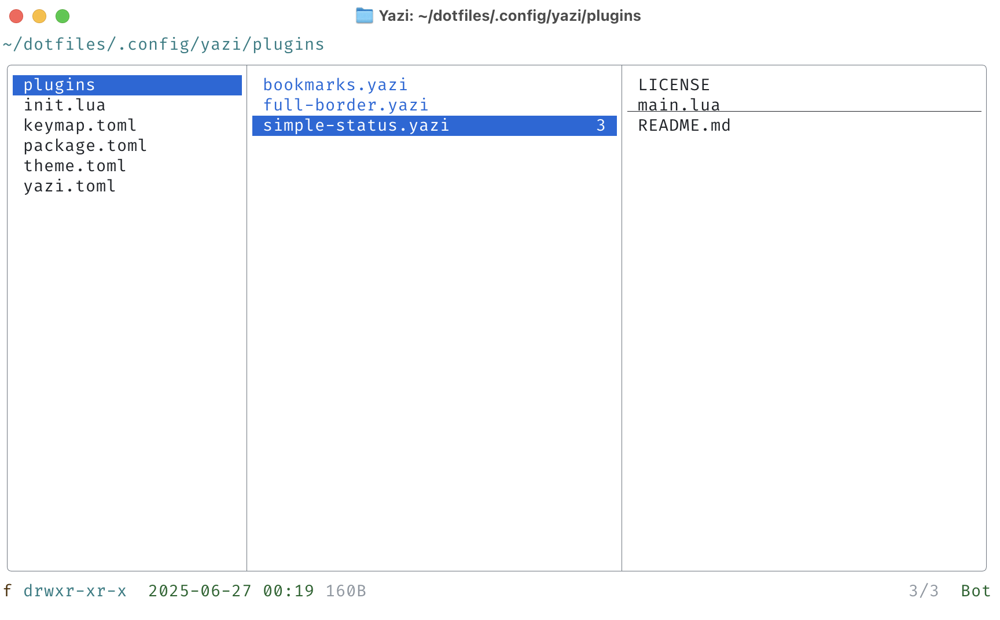

# simple-status.yazi



## Installation

```sh
ya pkg add f-ilic/simple-status
```

## Usage

Add this to your `~/.config/yazi/init.lua` to enable the plugin:

```lua
require("simple-status"):setup()
```

## License

This plugin is MIT-licensed. For more information check the [LICENSE](LICENSE) file.
